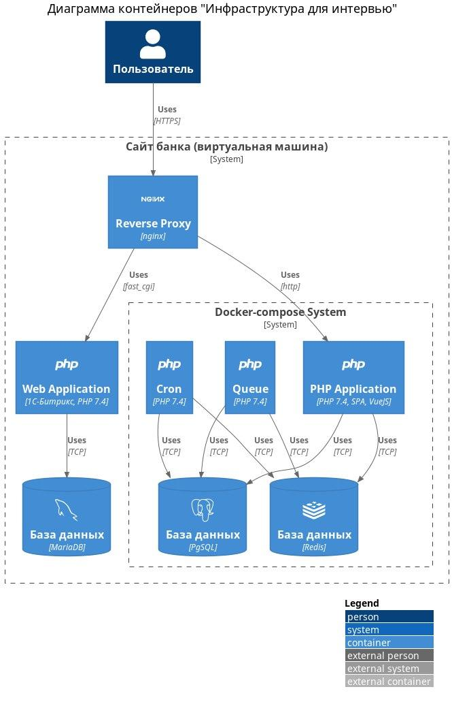

## Решение задач

### Задача 1.

Что можно улучшить в данной архитектуре? 

### Задача 2.

Разработчик, который совсем не разбирается в вопросах инфраструктуры, приходит с проблемой: нужно развернуть проект. Какие важные вопросы затронешь?

Стек проекта: PHP + PgSQL + Gitlab
